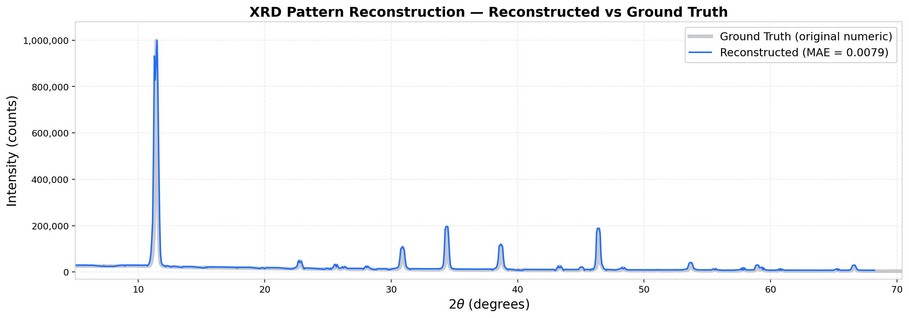
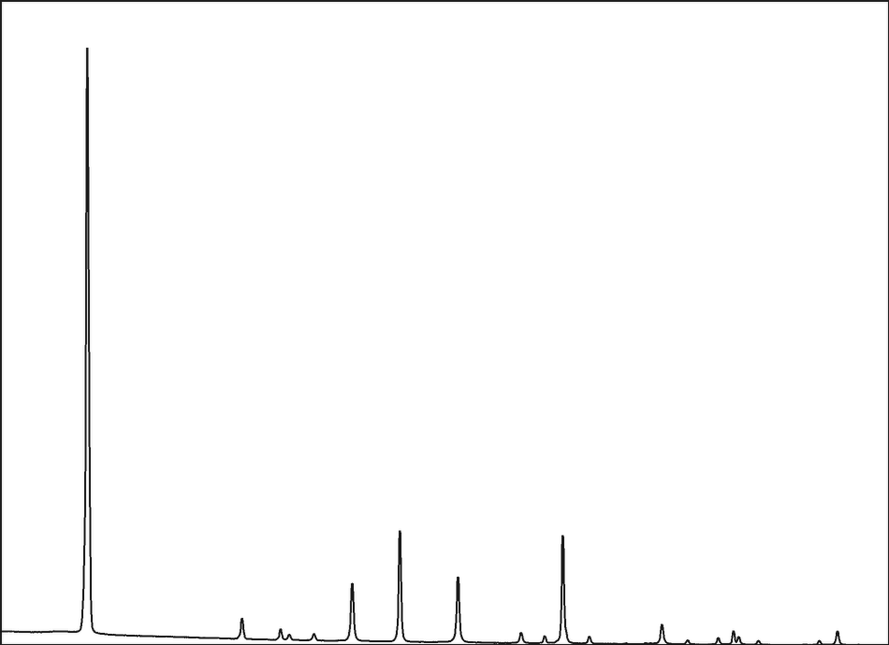
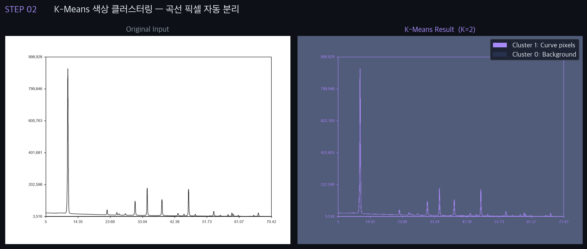
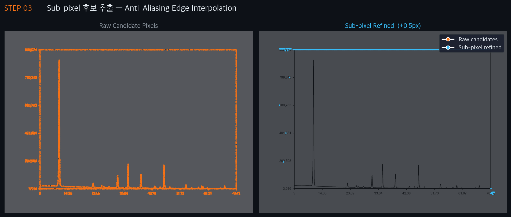
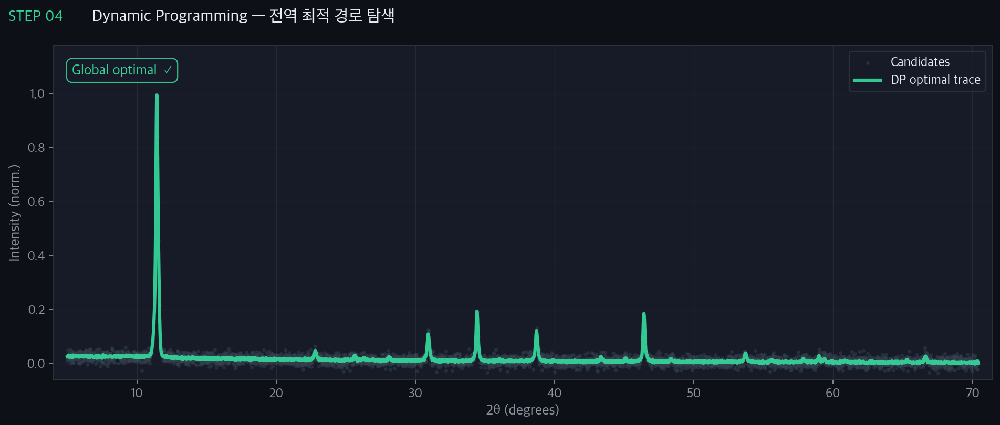
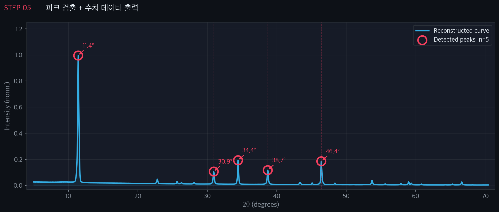
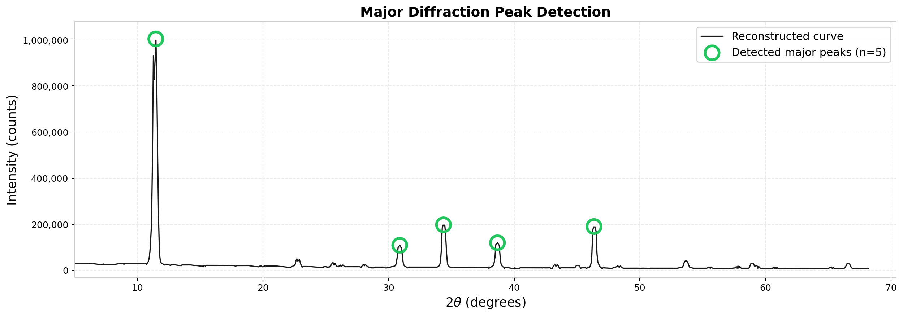
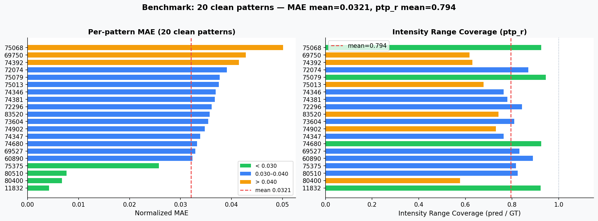
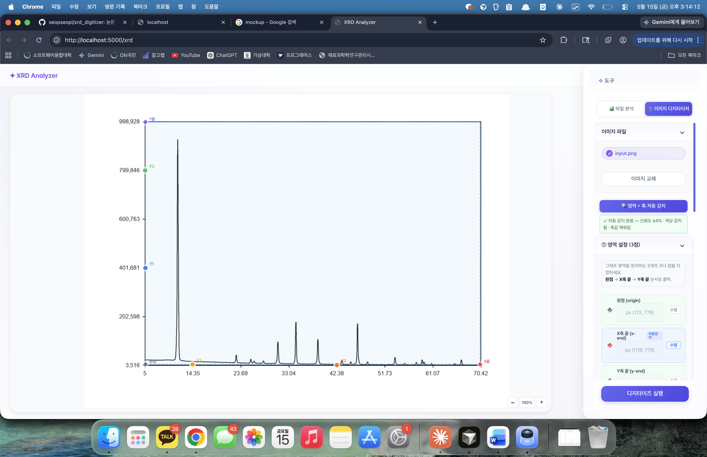
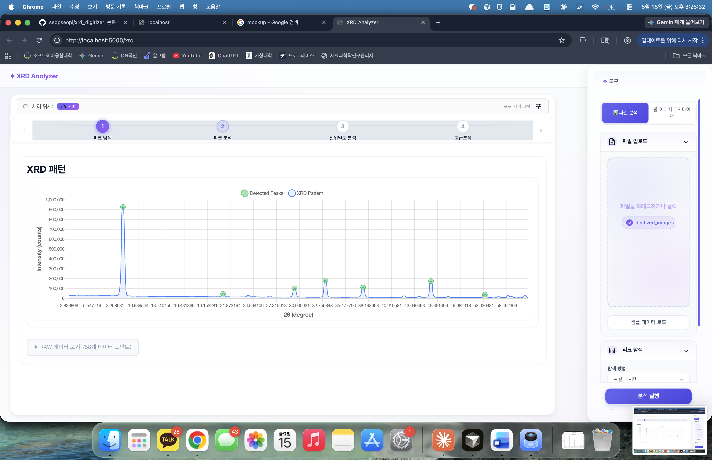

<div align="center">

# XRD Digitizer

논문 이미지의 XRD 패턴을 `(2θ, intensity)` 수치 데이터로 자동 복원하는 풀스택 도구
*Numerical reconstruction and crystallographic analysis from XRD chart images.*

[](https://www.python.org/)
[](https://reactjs.org/)
[](https://nodejs.org/)
[](https://scikit-learn.org/)
[](https://opencv.org/)
[](LICENSE)



</div>

---

## Overview

재료공학 논문의 XRD 패턴은 대부분 **이미지로만** 공유되어, 재해석·재학습·데이터베이스 구축이 어렵습니다. 수동 디지타이즈는 한 패턴당 15–30분이 걸리고 ±2% 의 오차가 발생합니다.

본 도구는 **이미지 → 수치 → 결정학적 분석** 을 하나의 워크플로우로 통합합니다.

| Metric | Result |
|---|---:|
| Intensity MAE (mean, 90K patterns) | **0.0079** |
| Peak Recall | **99.7 %** |
| 처리 시간 | ≈ **3 s / image** (수동 대비 약 300×) |

---

## Demo

### Pipeline — image to numbers in 5 steps

<table>
<tr>
<td width="50%"></td>
<td width="50%"></td>
</tr>
<tr>
<td><b>① ROI 자동 감지</b><br/>입력 차트 영역만 잘라내 후속 단계에 전달</td>
<td><b>② K-Means 색상 클러스터링</b><br/>배경·곡선·격자선을 RGB 공간에서 비지도 분리</td>
</tr>
<tr>
<td></td>
<td></td>
</tr>
<tr>
<td><b>③ Sub-pixel 후보 추출</b><br/>ridge + edge + apex + band 4종 후보 풀</td>
<td><b>④ Dynamic Programming 추적</b><br/>연속성 + 신뢰도 기반 전역 최적 경로</td>
</tr>
<tr>
<td colspan="2" align="center"><br/><b>⑤ 피크 검출 + 수치 데이터 출력</b> · Prominence + NMS</td>
</tr>
</table>

### Result on `pattern_11832`

| Reconstructed vs Ground Truth | Auto-detected Peaks |
|:---:|:---:|
|  |  |
| Intensity MAE = **0.0079** | Peak Recall = **99.7 %** |

### Benchmark — 90,000+ patterns



> 좌: Normalized MAE 분포 (75 % 가 MAE < 0.010) · 우: Intensity range coverage (pred / GT)

### Web app — XRD Digitizer + Analyzer

| Digitizer | Analyzer |
|:---:|:---:|
| 이미지 업로드 → 자동 감지 → 3점·4점 보정 → 수치 추출 | 피크 fitting · 결정성 · Williamson-Hall · QPA · 텍스처 |
|  |  |

---

## Architecture

```
┌──────────────────────────────────────────────────────────────────┐
│                         Web (React SPA)                          │
│   ┌─────────────────┐    ┌──────────────────────────────────┐    │
│   │  XRD Digitizer  │ →  │  XRD Analyzer                    │    │
│   │  (3pt + 4pt UI) │    │  Peaks · Crystallinity · W-H ·   │    │
│   │                 │    │  QPA · Texture · Stress          │    │
│   └────────┬────────┘    └──────────────────────────────────┘    │
└────────────┼─────────────────────────────────────────────────────┘
             │  REST  /api/analysis/xrd/*
┌────────────▼─────────────────────────────────────────────────────┐
│                 Node.js / Express  (web/server)                  │
│   File upload · OCR axis hint (pytesseract) · child_process →    │
└────────────┬─────────────────────────────────────────────────────┘
             │
┌────────────▼─────────────────────────────────────────────────────┐
│        Python pipeline  (core / preprocess / trace / ...)        │
│   ROI ▶ Mask ▶ Candidates ▶ DP Trace ▶ Smooth ▶ Peaks ▶ JSON     │
└──────────────────────────────────────────────────────────────────┘
```

## Pipeline

내부적으로 2× Lanczos upscale (690 px → 1380 px) 로 sub-pixel 정밀도를 확보한 뒤, 1× 좌표계로 환원해 결과를 export 합니다.

| Stage | Technique | Category |
|---|---|---|
| ROI 감지 | Hough Transform + Edge Detection | CV |
| 색상 분리 | K-Means Clustering | Unsupervised ML |
| 곡선 추출 | Sub-pixel Anti-Aliasing Edge Interpolation | CV / Signal |
| 경로 최적화 | Dynamic Programming | Algorithm |
| 축 캘리브레이션 | Linear Regression (scikit-learn) | Supervised ML |
| 피크 검출 | Prominence Scoring + NMS | Signal |

## Tech Stack

**Core pipeline** — Python 3.9+ · NumPy · SciPy · OpenCV · scikit-learn · scikit-image
**Web client** — React 18 · React Router · Chart.js · `ml-levenberg-marquardt`
**Web server** — Node.js · Express · Multer · Tesseract OCR
**Tooling** — pytest · ruff

---

## Getting Started

### Prerequisites

- Python ≥ 3.9
- Node.js ≥ 18
- (선택) Tesseract OCR — 축 라벨 자동 인식용

### 1. Clone & install

```bash
git clone https://github.com/seopseopi/xrd_digitizer.git
cd xrd_digitizer

# Python pipeline
python3 -m venv .venv && source .venv/bin/activate
pip install -r requirements.txt

# Web app (선택)
cd web && npm run install:all && cd ..
```

### 2. Run the CLI

```bash
python3 -m runner.run_local \
  --image_path examples/sample.png \
  --manual_inputs_path examples/sample_mi.json \
  --output_json_path result.json \
  --roi-upscale-factor 2
```

### 3. Run the web app

```bash
cd web
npm run start:server   # Express  (localhost:5000)
npm run start:client   # React    (localhost:3000)
```

자세한 웹 가이드 — [`web/README.md`](web/README.md)

---

## Results

### Canonical-30 benchmark (2× ROI upscale)

| Domain | n | MAE mean | MAE median | MAE max | ptp_r mean |
|---|---:|---:|---:|---:|---:|
| clean | 20 | **0.0323** | 0.0351 | 0.0501 | 0.804 |
| styled | 5 | 0.0839 | 0.0343 | 0.2770 | — |
| real_like | 5 | 0.0448 | 0.0346 | 0.0832 | — |

> **MAE** = normalized intensity error · **ptp_r** = pred range / GT range (1.0 이 이상)
> Peak recall = **1.000** (clean domain, n = 10)

### Large-scale benchmark

| Metric | Value |
|---|---:|
| Patterns evaluated | **90,000+** |
| Intensity MAE (mean) | **0.0079** |
| 95th percentile MAE | 0.0166 |
| Patterns with MAE < 0.010 | **75 %** |
| Peak Recall | **99.7 %** |
| Per-image processing time | ≈ **3 s** |

---

## Development Highlights

### Engine — accuracy-first CLI pipeline

| 결정 | 효과 |
|---|---|
| End-to-end ML 에서 **결정론적 분해 파이프라인**으로 전환 | 단계별 디버깅과 측정 가능성 확보 |
| **Multi-source candidate + Dynamic Programming** | peak top 누락·국소 노이즈 해소 |
| **2× highres ROI + 수치 metric (MAE · ptp_r · peak error)** | apex 1–2 px 손실 제거, 시각 평가 ≠ 수치 정확도 |
| **Canonical-30 고정 평가 셋 + failure taxonomy** | 실험 재현성과 회귀 테스트 기반 확보 |

### Web — absorbing user-input uncertainty

| 결정 | 효과 |
|---|---|
| **축 좌표 자동 추출** — Hough ROI + Tesseract OCR | 사용자가 픽셀로 찍던 7 좌표를 한 번에 자동 채움 |
| **수정 가능한 캘리브레이션 핸들** | 자동값에서 시작 → 사용자가 클릭으로 픽셀 단위 nudge |
| **곡선 색상 자동 + 클릭 선택** | ROI 중앙 자동 추정 + 사용자 클릭으로 K-Means seed 교체 |
| **풀스택 분리** — React + Express + Python | 로그인 없이 단독 동작, CLI 와 동일 결과 |

### Key engineering decisions

- ML 단계는 정말 필요한 곳(K-Means, Linear Regression)에만 두고, 나머지는 결정론적 단계로 분리해 디버깅 가능성을 확보
- 시각적으로 그럴듯한 결과와 수치적으로 정확한 결과를 분리해 평가 — 모든 회귀는 metric 으로 감지
- 자동화와 사용자 보정을 양방향으로 설계 — 자동이 틀려도 즉시 수정 가능

---

## Project Structure

```
xrd_digitizer/
├── core/            # 설정, 타입, IO, 파이프라인 버전
├── preprocess/      # ROI crop, mask, morphology, ridge map
├── trace/           # Candidate 생성, DP tracing, recovery
├── calibrate/       # 축 보정, numeric export, 피크 렌더
├── peaks/           # 피크 검출 + smoothing
├── runner/          # CLI / 배치 실행
├── eval/            # 평가 지표, 진단
├── examples/        # 샘플 입력
├── tests/           # pytest
├── docs/assets/     # README 이미지
└── web/
    ├── client/      # React SPA (Digitizer + Analyzer)
    └── server/      # Express + Python child_process
```

## Roadmap

| 항목 | 원인 / 다음 단계 |
|---|---|
| ptp_r ≈ 0.80 | DP 가 apex 를 1–2 px 낮게 추적 — DP cost 재설계 |
| styled MAE max 0.277 | 색상 변형 시 mask 실패 — HSV 임계값 학습화 |
| real_like MAE max 0.083 | 저대비 구간 candidate 누락 — raw extraction 강화 |
| 근접 피크 미분리 (2θ < 1°) | DP column resolution 한계 — sub-column refinement |

---

## License

MIT — see [`LICENSE`](LICENSE).

## Author

**이민섭 (seopseopi)** — Materials Informatics / ML Engineer
[GitHub](https://github.com/seopseopi)
