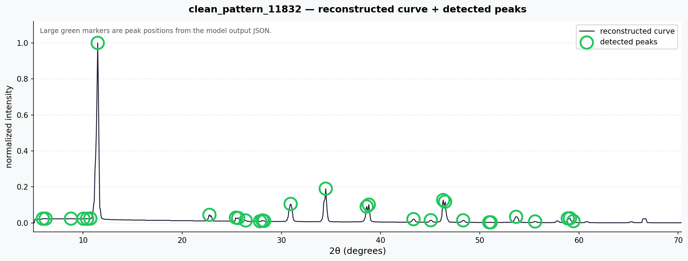
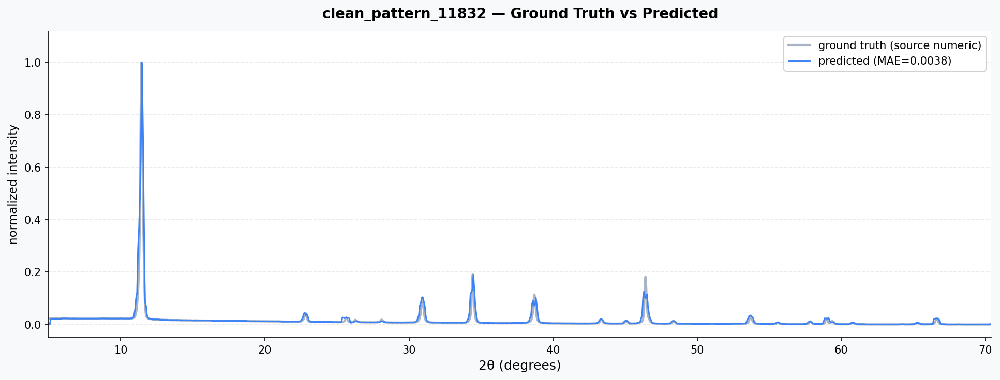

# XRD Digitizer

XRD 패턴 이미지에서 `(2θ, intensity)` 수치 배열을 자동 복원하는 deterministic pipeline.

```
입력: XRD 이미지 + 축 보정 좌표(mi.json)
출력: { two_theta_values, intensities, peaks_numeric_curve }
```

---

## 출력 예시

| 복원 곡선 + 피크 검출 | GT vs Predicted |
|---|---|
|  |  |

---

## 파이프라인

```
① ROI crop & 2× Lanczos upscale  (690px → 1380px)
② HSV color mask  →  curve 픽셀 분리
③ multi-source candidate generation  (ridge + edge + peak-apex + band-midline)
④ candidate filtering & confidence ranking
⑤ column-wise Dynamic Programming  →  최적 경로 선택
⑥ smoothing + 피크 검출 (prominence + NMS)
⑦ axis calibration  →  JSON export  (1900 pt highres)
```

| 단계 | 시각화 |
|------|--------|
| ① ROI |  |
| ② Mask |  |
| ③ Candidates |  |
| ④⑤ DP trace |  |
| ⑥ Peaks |  |

---

## 성능


**canonical-30 benchmark (2× ROI upscale)**

| domain | n | MAE mean | MAE median | MAE max | ptp\_r mean |
|--------|--:|---------:|-----------:|--------:|------------:|
| clean | 20 | **0.0323** | 0.0351 | 0.0501 | 0.804 |
| styled | 5 | 0.0839 | 0.0343 | 0.2770 | — |
| real\_like | 5 | 0.0448 | 0.0346 | 0.0832 | — |

> **MAE** = normalized intensity 오차 (GT intensity range 기준)  
> **ptp\_r** = pred range / GT range  (1.0이 이상적)

**clean domain 패턴별 분포 (n=41)**

| 구간 | 패턴 수 | 비율 |
|------|--------:|-----:|
| MAE < 0.03 | 11 | 27% |
| 0.03 ≤ MAE < 0.05 | 19 | 46% |
| MAE ≥ 0.05 | 11 | 27% |

peak recall = **1.000** (clean 10개 기준)

---

## 개발 히스토리

| # | 변경 | 핵심 문제 | 결과 |
|---|------|----------|------|
| 1 | End-to-end ML 시도 | 실패 원인 추적 불가, y amplitude 틀림 | 방향 전환 |
| 2 | Heatmap / skeleton 기반 곡선 검출 | skeleton이 peak 중앙 아래를 추적 → y값 저하 | 방향 전환 |
| 3 | Numeric JSON reconstruction 재정의 | 시각적 유사 ≠ 수치 정확도 | deterministic pipeline 설계 |
| 4 | 수동 좌표 입력(mi.json) + manifest pair | x/y calibration 오차, pair integrity 없음 | 기준 좌표계 고정 |
| 5 | Multi-source candidate 구조 도입 | 단일 소스로 peak top 누락 | 후보 풀 다양화 |
| 6 | DP 경로 선택 + cost 설계 | bottom branch lock, peak top flattening | continuity/sharpness 균형 |
| 7 | 평가 기준: highres numeric metric | 시각 평가로 2× 효과 숨겨짐 | MAE / ptp\_r / peak error 도입 |
| 8 | canonical-30 test set 고정 | 실험 재현성 없음 | manifest 기반 30개 고정 |
| 9 | Failure taxonomy 도입 | "실패"를 분류 불가 | 6개 subtype 정의 |
| 10 | 2× highres ROI upscale (`8568720`) | 1-2px apex 손실 | 내부 1900×1380px 처리 |
| 11 | Amorphous hump 처리 (`3dc7715`) | hump 위 피크를 DP가 무시 | wide-band trend attraction 도입 |
| 12 | Debug 좌표 오류 수정 (`9f6e49e`) | 2× 이미지에 1× axis map 적용 → 마커 오프셋 | axis map scale 보정 |
| 13 | y-pixel 변환 버그 수정 (`7cba173`) | 2× y픽셀이 1× y_map에 입력 → intensity 2× 오차 | **MAE 0.0334 → 0.0323 (−3.3%)** |

### Phase 13 — 핵심 버그 (y-pixel 단위 변환)

```python
# ❌ 버그: y_tgt가 2× 픽셀 그대로 반환
x_tgt = np.arange(original_roi_w) * float(factor)   # [0, 2, 4, ...]
y_tgt = np.interp(x_tgt, x_src, y_src)              # 2× y px !
return list(range(original_roi_w)), y_tgt, ...

# ✅ 수정
y_tgt = np.interp(x_tgt, x_src, y_src) / float(factor)  # 1× y px
```

| 지표 | 수정 전 | 수정 후 |
|------|--------:|--------:|
| MAE mean | 0.0334 | **0.0323** |
| 피크 마커 | apex 절반 높이 | apex 정확히 위치 |

---

## 남은 한계

| 항목 | 수치 | 원인 |
|------|------|------|
| ptp\_r ≈ 0.80 | 예측 intensity range가 GT의 약 80% | DP가 peak apex를 1–2px 낮게 추적 |
| styled MAE max 0.277 | 색상 변형 시 color mask 실패 | HSV 임계값 고정 |
| real\_like MAE max 0.083 | 저대비 구간에서 candidate 누락 | raw extraction 한계 |
| 근접 피크 미분리 | 2θ 간격 < 1° doublet → 미분리 | DP column resolution 한계 |
| manual input 필요 | 축 보정 좌표 직접 입력 | 자동화 미구현 |

---

## 사용법

```bash
# 단일 이미지
python3 -m runner.run_local \
  --image_path input.png \
  --manual_inputs_path mi.json \
  --output_json_path result.json \
  --debug_dir debug/ \
  --roi-upscale-factor 2

# 배치
python3 -m runner.batch_run \
  --manifest_csv data/test_canonical_30/manifest.csv \
  --output_dir outputs/ \
  --roi-upscale-factor 2 \
  --max_samples 30
```

**mi.json 최소 구조**

```json
{
  "plot_box": [170, 90, 1120, 780],
  "x_axis_points": [[170, 780], [1120, 780]],
  "x_axis_values": [5.0, 70.4],
  "y_axis_points": [[170, 780], [170, 90]],
  "y_axis_values": [0.0, 1.0],
  "color_sample_point": [500, 400]
}
```

---

## 설치

```bash
python3 -m venv .venv && source .venv/bin/activate
pip install -r requirements.txt
```

## 구조

```
core/        설정, 타입, IO, 파이프라인 버전
preprocess/  ROI crop, mask, morphology, ridge map
trace/       candidate 생성, DP tracing, recovery
calibrate/   축 보정, numeric export, 피크 렌더
peaks/       피크 검출 + smoothing
runner/      CLI / 배치 실행
eval/        평가 지표, 진단
data/        canonical-30 benchmark
```
