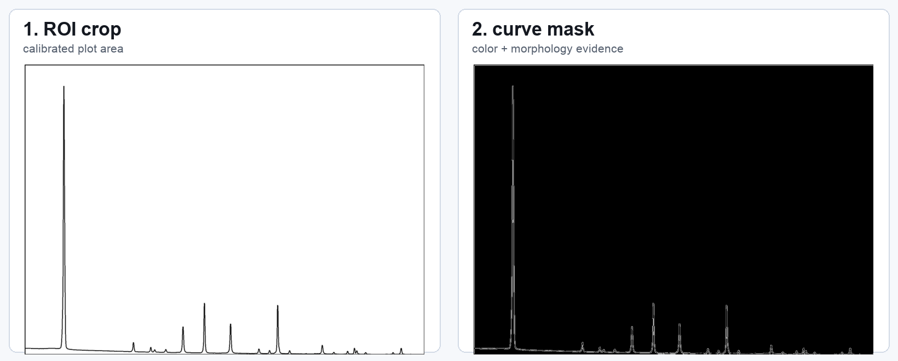
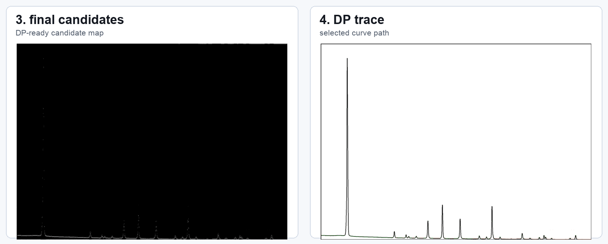
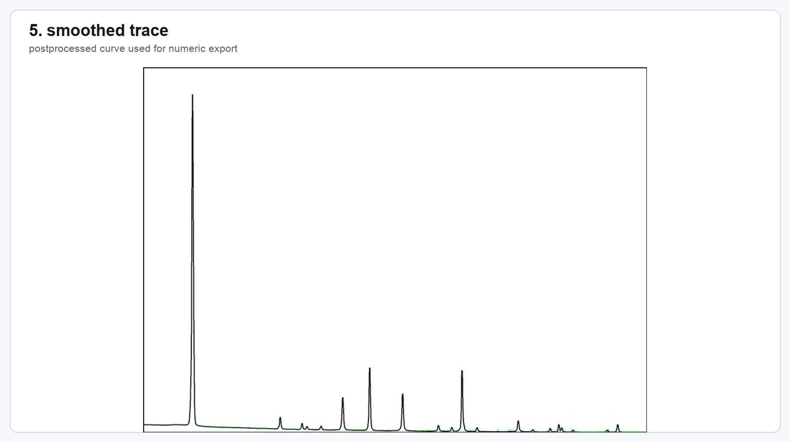
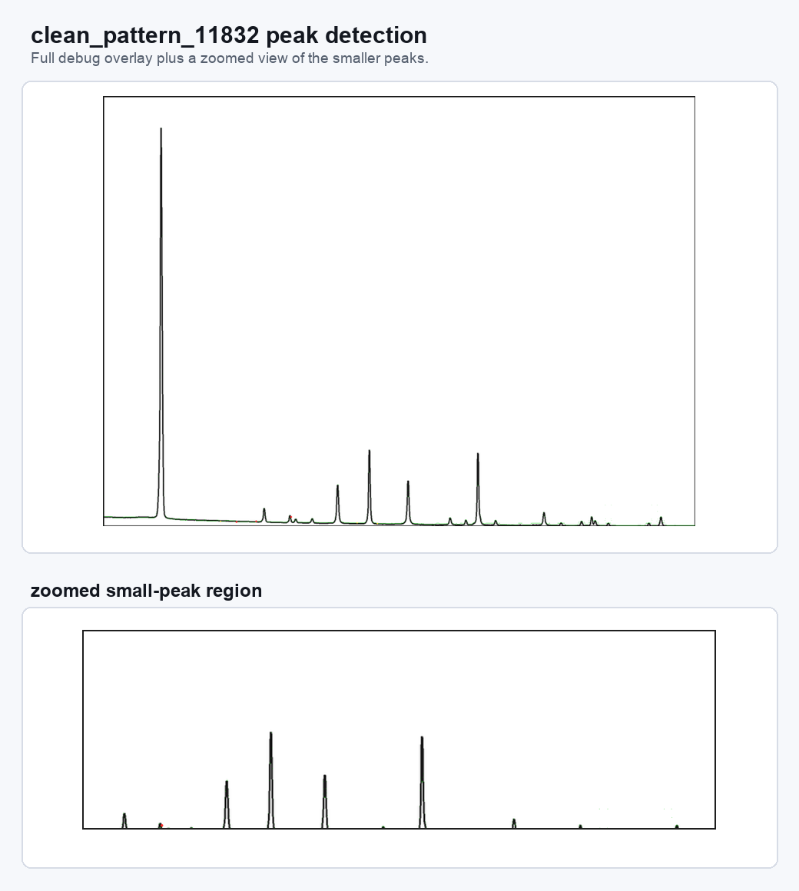
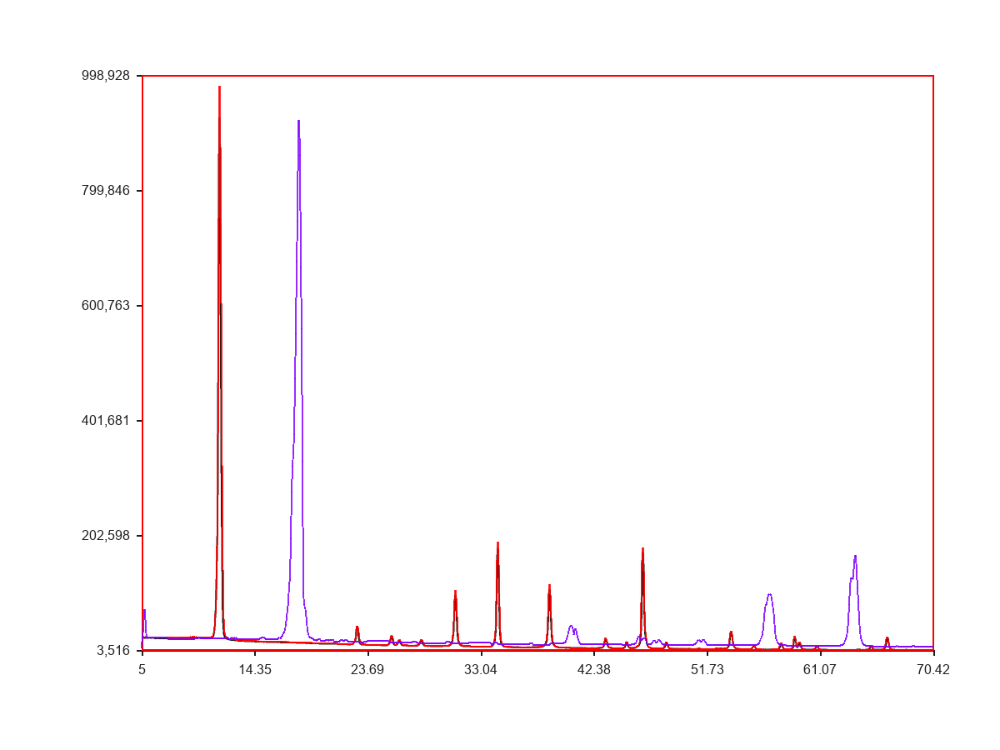

# XRD Digitizer

XRD 그래프 이미지를 읽어서 `two_theta` / `intensity` 수치 데이터로 복원하는 이미지 digitizing 파이프라인입니다.

핵심은 “그래프 안의 곡선을 후보로 만들고, DP tracing으로 가장 자연스러운 경로를 따라간 뒤, 축 보정값을 이용해 숫자 JSON으로 내보내는 것”입니다.

## 한눈에 보기

### 디버그 이미지로 보는 처리 과정

`clean_pattern_11832`를 실제로 실행했을 때 생성된 debug 이미지입니다.

ROI crop, mask, final candidates, DP trace, smoothing 순서로 모델이 그래프를 따라가는 과정을 보여줍니다. GitHub에서 잘 보이도록 단계별 이미지를 나눴습니다.







### 피크 검출 예시

같은 샘플의 `debug/14_peaks_overlay.png`에서 peak 검출 결과와 작은 peak 구간을 확대했습니다.



### 수치 복원 비교

highres export 결과와 source numeric curve를 비교한 예시입니다. 이미지에서 추적한 곡선을 실제 수치 데이터로 다시 복원한 결과를 확인할 수 있습니다.



## 최근 성능 개선

highres 후보 생성 / bridge 단계 병목을 벡터화해서, 출력은 동일하게 유지하면서 실행 시간을 크게 줄였습니다.

| 항목 | 이전 | 이후 | 개선 |
| --- | ---: | ---: | ---: |
| `clean_pattern_11832` candidates stage | 391.03s | 19.52s | 약 20.0x |
| `clean_pattern_11832` bridge stage | 390.85s | 19.39s | 약 20.2x |

동일성 검증:

| 샘플 | 결과 | max_abs_diff |
| --- | --- | ---: |
| `clean_pattern_11832` | `PASS_EQUIVALENT` | 0.0 |
| `styled_pattern_72296` | `PASS_EQUIVALENT` | 0.0 |
| `real_like_pattern_83398` | `PASS_EQUIVALENT` | 0.0 |

## 실행 방법

```bash
python3 runner/run_local.py \
  --image_path path/to/input.png \
  --manual_inputs_path path/to/manual_inputs.json \
  --output_json_path outputs/result.json \
  --debug_dir outputs/debug \
  --pipeline v1_1
```

highres export:

```bash
python3 runner/run_local.py \
  --image_path path/to/input.png \
  --manual_inputs_path path/to/manual_inputs.json \
  --output_json_path outputs/result.json \
  --debug_dir outputs/debug \
  --pipeline v1_1 \
  --roi-upscale-factor 2 \
  --final-export-mode highres
```

manual input 예시는 여기 있습니다:

```text
examples/manual_input_sample.json
```

## 설치

```bash
python3 -m venv .venv
source .venv/bin/activate
pip install -r requirements.txt
```

`torch`는 선택 ML 유틸리티용입니다. 기본 rule-based runner는 학습된 모델 체크포인트 없이 실행됩니다.

## 테스트

```bash
python3 -m pytest
```

빠른 문법 확인:

```bash
python3 -m py_compile runner/run_local.py trace/candidates.py
```

## 구조

```text
core/        설정, 타입, IO, 파이프라인 버전
preprocess/  ROI, perspective, mask, morphology, ridge map
trace/       후보 생성, bridge 확장, DP tracing, recovery, postprocess
calibrate/   축 보정과 numeric export
peaks/       peak 검출과 smoothing
runner/      CLI / batch 실행 진입점
eval/        평가 지표와 진단 도구
ml/          선택적 candidate reranking 유틸리티
scripts/     연구, 진단, 평가, 리포트 스크립트
tests/       회귀 / 단위 테스트
docs/        설명 문서와 README 이미지 asset
examples/    작은 입력 예시
```

## Git에 넣지 않는 것

아래는 로컬 데이터/산출물이므로 커밋하지 않습니다.

```text
data/
outputs/
debug_artifacts/
dist/
experiments/archive/
```

GitHub에는 코드, 작은 예시 이미지, 문서만 남기고 대용량 결과물은 제외합니다.

## 현재 기준

- 운영 기본 파이프라인: `--pipeline v1_1`
- highres 출력: `--roi-upscale-factor 2 --final-export-mode highres`
- 핵심 후보 최적화 파일: `trace/candidates.py`
- 기본 실행 파일: `runner/run_local.py`

## License

아직 license 파일은 없습니다. 공개 재사용 목적이면 별도 license를 추가해야 합니다.
