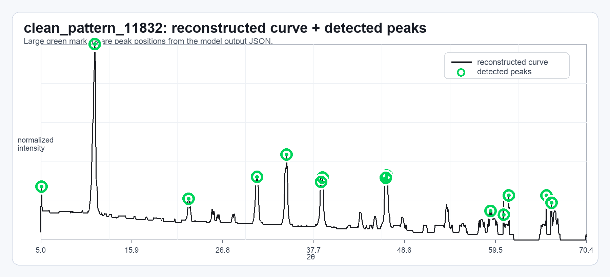

# XRD Digitizer

XRD 그래프 이미지에서 `two_theta` / `intensity` 수치 데이터를 자동으로 복원하는 파이프라인입니다.

**처리 흐름:** ROI crop → perspective 보정 → 색상 기반 curve mask → DP tracing → 축 보정 → JSON 출력

---

## 처리 과정 시각화

`clean_pattern_11832` 실행 예시 — ROI crop, mask, candidates, DP trace, smoothing 단계를 순서대로 보여줍니다.

| 단계 | 이미지 |
|------|--------|
| ROI crop & mask |  |
| Candidates & DP trace |  |
| Smoothed trace |  |

### 피크 검출 결과

복원된 곡선 위에 검출된 피크 위치를 초록색 마커로 표시합니다.



---

## 설치

```bash
python3 -m venv .venv
source .venv/bin/activate
pip install -r requirements.txt
```

> `torch`는 선택 사항입니다. 기본 rule-based 파이프라인은 학습된 모델 없이 실행됩니다.

---

## 사용법

### 단일 이미지 실행

```bash
python3 runner/run_local.py \
  --image_path path/to/input.png \
  --manual_inputs_path path/to/manual_inputs.json \
  --output_json_path outputs/result.json \
  --debug_dir outputs/debug \
  --pipeline v1_1
```

### highres 출력 (권장)

2배 해상도로 upscale한 뒤 export합니다. 정밀도가 높아집니다.

```bash
python3 runner/run_local.py \
  --image_path path/to/input.png \
  --manual_inputs_path path/to/manual_inputs.json \
  --output_json_path outputs/result.json \
  --debug_dir outputs/debug \
  --pipeline v1_1 \
  --roi-upscale-factor 2 \
  --final-export-mode highres
```

### 배치 실행

```bash
python3 runner/batch_run.py \
  --manifest path/to/manifest.json \
  --output_dir outputs/
```

`manual_inputs` 형식 예시: [`examples/manual_input_sample.json`](examples/manual_input_sample.json)

---

## 프로젝트 구조

```
core/        설정, 타입, IO, 파이프라인 버전
preprocess/  ROI crop, perspective 보정, mask, morphology, ridge map
trace/       후보 생성, bridge 확장, DP tracing, recovery, postprocess
calibrate/   축 보정, numeric export, 피크 디버그 렌더
peaks/       피크 검출과 smoothing
runner/      CLI / 배치 실행 진입점
eval/        평가 지표와 진단 유틸리티
ml/          선택적 candidate reranking 유틸리티 (PyTorch 필요)
tests/       회귀 / 단위 테스트
docs/        README 이미지 asset
examples/    입력 예시
```

---

## 현재 기본 설정

| 항목 | 값 |
|------|----|
| 운영 파이프라인 | `--pipeline v1_1` |
| highres 출력 | `--roi-upscale-factor 2 --final-export-mode highres` |
| `--axis-mask-margin` | `15` |
| `--mask-b-mag-percentile` | `50` |
| `--mask-b-thr-clip-lo` | `10` |
| `--mask-b-thr-clip-hi` | `40` |

---

## 성능 (canonical 30 기준)

| domain | MAE |
|--------|----:|
| clean | 0.0324 |
| styled | 0.0360 |
| real\_like | 0.0345 |

---

## 테스트

```bash
python3 -m pytest
```

문법 빠른 확인:

```bash
python3 -m py_compile runner/run_local.py trace/candidates.py
```

---

## License

License 파일이 없습니다. 공개 재사용 목적이면 별도 license를 추가하세요.
